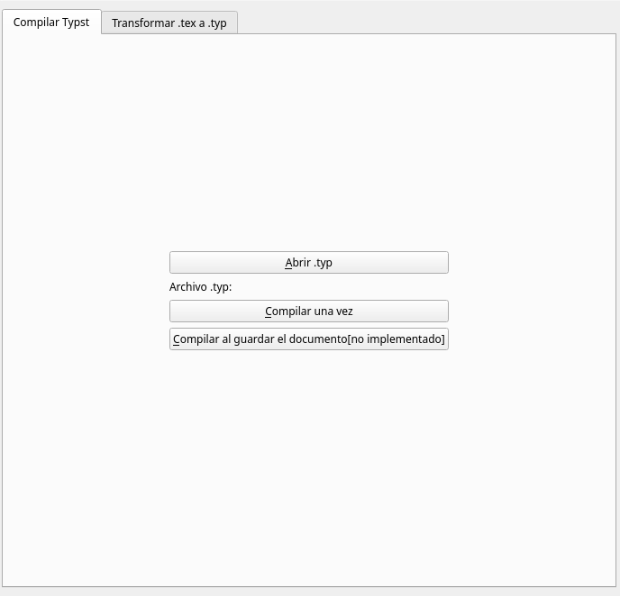
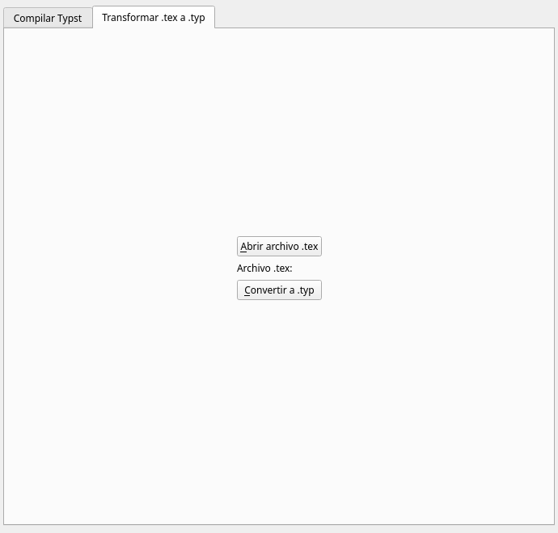

# 4typst

Este es un programita para convertir archivos `.tex` a formato `.typ`. Es posible que ocurran errores de formato, el objetivo del programa es tener un atajo para no escribir de cero un archivo `.tex` en formato `.typ`.

El programa hace una conversión usando [pandoc](https://pandoc.org). Se usa el filtro `filtro.lua` para que los ambientes de teoremas queden en formato `#thm[...]`.

## Código externo

El archivo `theorems.typ` es código de [sahasatvik](https://github.com/sahasatvik/typst-theorems).

# Dependencias

- `python`
- Tener `pyqt5` instalado
    - Basta con escribir el comando `pip install pyqt5` en una consola
- Tener la [última versión de pandoc](https://pandoc.org/installing.html) instalada.
    - En Windows basta con usar el instalador que aparece en la página
    - En Linux basta con descargar [la última versión de la página de github](https://github.com/jgm/pandoc/releases) y dejar el binario `pandoc` en la carpeta `$HOME/.local/bin`
- Opcional. Tener `typst` instalado para usar la pestaña `Compilar typst`. Se espera que el archivo generado se suba a [typst.app](https://typst.app) o bien se use un editor de texto local.
    - En Linux se puede descargar desde la [página de github](https://github.com/typst/typst/releases) y mover el binario `typst` a la carpeta `$HOME/.local/bin`.
    - En Windows no sé. De todas formas, se puede instalar [typst para VSCode(ium)](https://marketplace.visualstudio.com/items?itemName=nvarner.typst-lsp) y tener un editor local integrado.

# Uso

0. Descargar el repositorio
    - Si se tiene `git` instalado, escribir en alguna terminal `git clone https://github.com/fcastillob/4typst`
    - Si no, basta con ir a ese botoncito verde arriba que dice *Code* y descargar un `.zip`.
1. Ejecutar el archivo `main.py`.
2. Elegir la pestaña que se quiera usar
    - Compilar typst requiere tener typst instalado
3. Elegir el archivo
    - **Van a ocurrir errores si alguna carpeta en la dirección tiene espacios**
4. Compilar o transformar el archivo
5. *Comprobar posibles errores*
6. [Personalizar los teoremas generados en `theorems.typ`](https://github.com/sahasatvik/typst-theorems)

Los teoremas se van a exportar correctamente si en LaTeX se definen como `\newtheorem{*}{*}[*]`.
